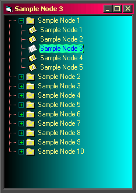

## Custom VB6 Treeview control

### Description

A UserControl made with a VB6 Treeview control (MSCOMCTL.OCX - 6.00.8862)

with customized Background (Color, GradientRectHor, GradientRectHor

GradientTri, tiled Picture), Backcolor, Forecolor, Buttons, Tooltips etc.
 
### More Info
 
The UserControl does not repaint correctly if the ClipControls property of the Form1 has been set to False

Some of the Background options behave strangely, because of the Treeview control, but this is only a demo, showing some ways to draw on a VB6 Treeview background.

If Background = fvGrdntRectVer or fvGrdntTri or fvPicturedTiled (m_BackScroll = True) then the control

does not show Tooltips and Scrolls one at a time

             |
---                |---
**Submitted On**   |2001-07-16 02:50:36
**By**             |[Panos Koutsoukeras](https://github.com/Planet-Source-Code/PSCIndex/blob/master/ByAuthor/panos-koutsoukeras.md)
**Level**          |Advanced
**User Rating**    |4.9 (79 globes from 16 users)
**Compatibility**  |VB 6\.0
**Category**       |[Custom Controls/ Forms/  Menus](https://github.com/Planet-Source-Code/PSCIndex/blob/master/ByCategory/custom-controls-forms-menus__1-4.md)
**World**          |[Visual Basic](https://github.com/Planet-Source-Code/PSCIndex/blob/master/ByWorld/visual-basic.md)
**Archive File**   |[Custom VB6228267152001\.zip](https://github.com/Planet-Source-Code/panos-koutsoukeras-custom-vb6-treeview-control__1-25049/archive/master.zip)

